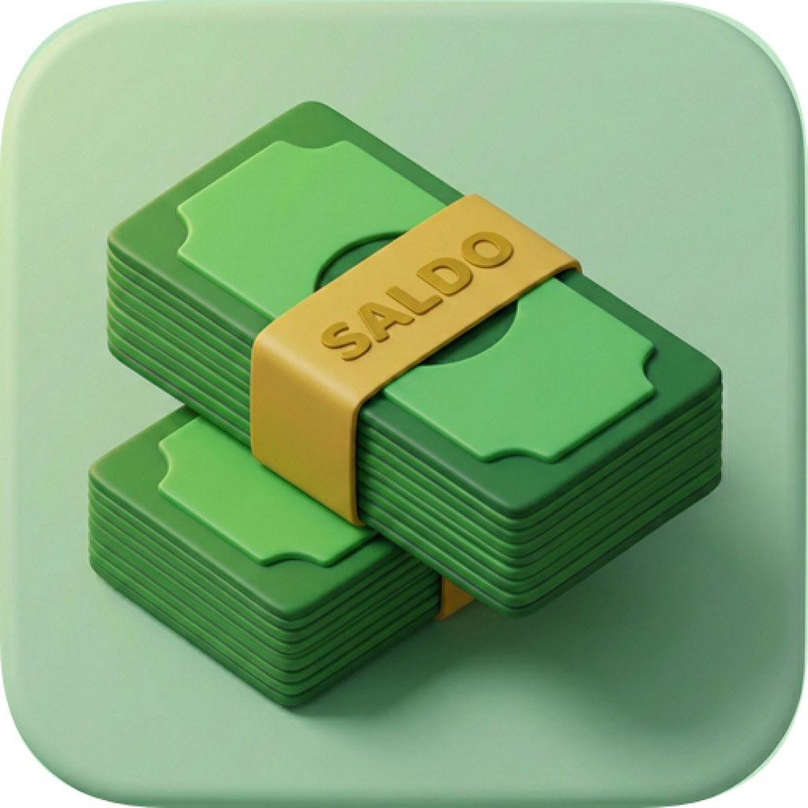

<div align="center">



# Saldo

**Personal Finance for the Allowance Generation**

[](https://developer.apple.com)
[](https://swift.org)
[](https://developer.apple.com/xcode/swiftui/)
[](LICENSE)

---

🏆 **Winner — Apple Swift Student Challenge 2026**

</div>

---

## The Story Behind Saldo

Every college student knows the feeling — the allowance arrives, and somehow, before the month is over, it is gone. Nobody teaches you where it went, and nobody teaches you how to stop it from happening again.

That gap is exactly why Saldo exists.

Built for students who are one step away from financial independence, Saldo is not just a budgeting app. It is a shift in mindset — from reactive to intentional, from confused to in control. The name *Saldo* means **balance** in several languages, and that is precisely what it gives you.

---

## What Saldo Does

### Track Your Balance in Real Time

The home dashboard is the one screen you need. It shows your remaining balance, your weekly spending trend, and your savings goals — all updated the moment you make a change.

The interface itself reacts to your financial health. The theme shifts from red to yellow to green as your balance improves, giving you instant, visual feedback on where you stand.

### Scan Receipts Without Thinking About It

Point your camera at any receipt and Saldo handles the rest. Using native iOS 26 document recognition, it extracts the total amount, stores the transaction, and adjusts your balance automatically. No typing. No friction.

### Set Savings Goals That Actually Feel Real

Saldo introduces **Grails** — a visual way to track what you are saving toward. Add a photo of the thing you want, and the app uses Apple's Vision framework to isolate the subject and display it beautifully. Up to three active goals at a time, kept front and center to stay on your mind.

### Know Your Subscriptions Before They Know You

Streaming. Music. AI tools. Educational platforms. They add up quietly. Saldo keeps a clear running list of every recurring commitment so nothing catches you off guard at the end of the month.

### Get Insights That Mean Something

The Insights screen breaks down your spending patterns and surfaces the changes that would actually move the needle. It uses on-device AI — no data ever leaves your phone.

---

## Built Entirely with Apple Frameworks

Saldo has no third-party dependencies. Every feature is implemented using the iOS SDK directly.

| Framework | Used For |
|---|---|
| **SwiftUI** | All views, animations, and navigation |
| **Vision** | Foreground masking for Grail images, OCR for receipts |
| **VisionKit** | Document camera integration |
| **Foundation Models** | On-device financial insights |
| **Core Graphics** | Contour rendering and image optimization |

---

## Technical Highlights

**Swift 6 Strict Concurrency** — The entire app is built with Swift 6's concurrency model. Image processing, OCR, and AI inference all run in actor-isolated contexts, keeping the UI thread free and the app feeling instant.

**Zero Cloud Dependency** — Every piece of data — transactions, Grail images, subscriptions — lives in the app's local storage. There is no backend, no sync service, and no account required. Your financial data stays on your device.

**Adaptive Theming Engine** — A custom `ThemeManager` maps your balance to a curated color palette and propagates it across the entire UI using a reactive `@Observable` architecture. The transition between states is animated.

**Versioned Image Pipeline** — Grail images go through a multi-stage processing pipeline: Vision masking → resolution optimization (1024px) → disk persistence → downsampled preview (320px) → contour cache warm-up. The pipeline is versioned with automatic migration for future format changes.

**Apple Maps-Style Bottom Sheet** — The main action panel uses a custom multi-detent sheet that collapses on scroll and coordinates presentation with every other modal in the app to prevent simultaneous sheet conflicts.

---

## Getting Started

Open the project directly in **Swift Playgrounds** or **Xcode**:

```
1. Open Saldo.swiftpm
2. Select an iOS 26.0+ device or simulator
3. Build and run
```

> Features requiring the device camera or Vision framework work best on physical hardware.

---

## Project Structure

```
Saldo.swiftpm
├── Views/          — Home, Transactions, Insights, Profile
├── Components/     — BalanceCard, WeeklySpendGraph, TransactionRow, GrailContourRenderer
├── Receipt/        — Document camera integration and OCR processing
├── Subscription/   — Recurring payment models and persistence
├── Onboarding/     — First-launch setup flow
├── Theme/          — Balance-driven adaptive theming system
└── Docs/           — Architecture documentation and design patterns
```

---

<div align="center">

Designed and built by **Aryaman Jaiswal**

*For students who are ready to take control.*

</div>
